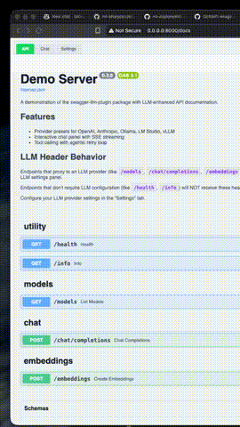

# Swagger LLM Plugin



> Add an LLM-enhanced API documentation to your FastAPI Swagger UI docs page.

`swagger-llm-ui` injects a collapsible **LLM Settings** panel at the top of your
FastAPI `/docs` page.  Users fill in their OpenAI-compatible API details (base URL,
API key, model, etc.) directly in the browser.  Those settings are saved to
`localStorage` and automatically forwarded as `X-LLM-*` request headers on every
"Try it out" call, so your FastAPI endpoints can read them without any extra work.

---

## Features

- 🤖 **LLM Settings Panel** – collapsible dark-themed form embedded in Swagger UI
- 🔗 **Connection tester** – hits the `/models` endpoint to verify credentials
- 💾 **Persistent** – settings survive page reloads via `localStorage`
- 🔒 **Header injection** – all Try-it-out calls carry `X-LLM-*` headers
- ⚡ **FastAPI dependency** – `get_llm_config()` extracts config from headers with one line
- 💬 **AI Chat Assistant** – ask questions about your API documentation with full OpenAPI context
- 📚 **Smart Context** – chat bot uses your `/openapi.json` schema to answer questions accurately
- 🎨 **Theme Support** – dark/light themes with custom color customization

---

## Installation

```bash
pip install swagger-llm-ui
```

---

## Quick Start

```python
from fastapi import FastAPI
from swagger_llm_ui import setup_llm_docs

app = FastAPI(title="My API")

# Replace the default /docs with the LLM-enhanced version
setup_llm_docs(app)
```

That's it.  Open `http://localhost:8000/docs` and you'll see:
1. The LLM Settings panel at the top of the page
2. Three tabs: **API Explorer**, **Chat**, and **Settings**

### Using the Chat Bot

The chat bot uses your `/openapi.json` schema to answer questions about your API:

1. Open the **Chat** tab in the docs page
2. Ask questions like:
   - "What endpoints are available?"
   - "How do I use the chat completions endpoint?"
   - "Generate a curl command for /health"
3. The bot has full access to your API's OpenAPI schema

The OpenAPI schema is automatically fetched and used as context for all chat messages.

---

## Reading LLM Config in Your Endpoints

```python
from fastapi import Depends
from swagger_llm_ui import LLMConfig, get_llm_config

@app.post("/chat/completions")
async def chat(body: ChatRequest, llm: LLMConfig = Depends(get_llm_config)):
    # llm.base_url, llm.api_key, llm.model_id, llm.max_tokens, llm.temperature
    # are all populated from the X-LLM-* headers injected by the browser panel
    ...
```

---

## Chat Bot Features

The chat bot has access to your API's OpenAPI schema and can answer questions
about endpoints, parameters, request bodies, and responses.

### Supported Questions

The chat bot can answer questions like:

- **General API info:** "What endpoints are available?" or "Tell me about this API"
- **Endpoint details:** "How do I use the /users endpoint?" or "What parameters does /search accept?"
- **Request examples:** "Generate a curl command for /health"
- **Schema information:** "What fields are in the User model?"

### How It Works

1. The chat panel fetches `/openapi.json` from your API
2. The full schema is converted to a human-readable context format
3. This context is sent as the system prompt with each chat message
4. The LLM uses this information to answer questions accurately

### Providers Supported

Any OpenAI-compatible API works:
- **OpenAI** - `https://api.openai.com/v1`
- **Anthropic** - `https://api.anthropic.com/v1`
- **Ollama** - `http://localhost:11434/v1` (local)
- **LM Studio** - `http://localhost:1234/v1` (local)
- **vLLM** - `http://localhost:8000/v1` (local)
- **Azure OpenAI** - Custom endpoint

---

## Configuration Options

### `setup_llm_docs(app, ...)`

| Parameter | Default | Description |
|-----------|---------|-------------|
| `docs_url` | `"/docs"` | URL path for the docs page |
| `title` | `"{app.title} – LLM Docs"` | Browser tab title |
| `openapi_url` | `app.openapi_url` | URL of the OpenAPI JSON schema |
| `swagger_js_url` | jsDelivr CDN | Swagger UI JS bundle URL |
| `swagger_css_url` | jsDelivr CDN | Swagger UI CSS URL |
| `debug` | `False` | Enable auto-reload for development |

### `LLMConfig` fields

| Field | Default | Header |
|-------|---------|--------|
| `base_url` | `"https://api.openai.com/v1"` | `X-LLM-Base-Url` |
| `api_key` | `None` | `X-LLM-Api-Key` |
| `model_id` | `"gpt-4"` | `X-LLM-Model-Id` |
| `max_tokens` | `4096` | `X-LLM-Max-Tokens` |
| `temperature` | `0.7` | `X-LLM-Temperature` |

---

## Demo Server

```bash
uvicorn examples.demo_server:app --reload
```

---

## Development

```bash
pip install -e ".[dev]"
pytest tests/
```

---

## License

MIT