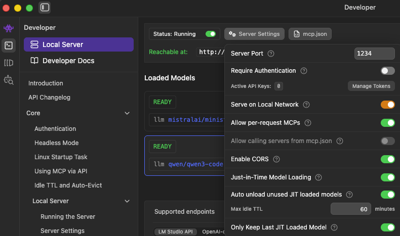
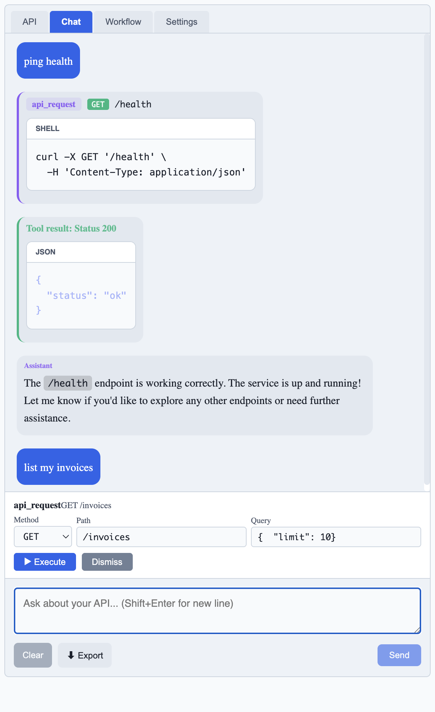

# SwaggerUI LLM Plugin

> Add an AI assistant to your `/docs` page.


## Features

- 💬 AI chat assistant with full OpenAPI context
- 🤖 LLM Settings panel with local providers (Ollama, LM Studio, vLLM, Custom)
- 🔗 Tool-calling for API Requests
- 🎨 Dark/light theme support


## Installation

```bash
pip install swagger-llm
```

## Quick Start

```python
from fastapi import FastAPI
from swagger_llm import setup_docs

app = FastAPI()
setup_docs(app)  # replaces default /docs
```

That's it! Visit `/docs`

## Configure LLM Settings

This plugin uses client-side JavaScript to connect to your local LLM provider. You can configure it in the **LLM Settings** tab in the Swagger UI:
- **Provider**: Choose your local LLM provider (Ollama, LM Studio, vLLM, or Custom)
- **API URL**: Enter the API endpoint for your LLM (e.g. `http://localhost:1234/v1` for LMStudio)
- **Test Connection**: Verify that the plugin can connect to your LLM provider and select a model from the drop down after.

Some local LLM providers will require additional configuration to work with the plugin. For example, LM Studio users will need to enable CORS in their LM Studio settings to allow the plugin to connect from the browser.



## Using the Chat Assistant

Ask questions like:
  - "What endpoints are available?"
  - "Show me how to use /users"
  - "Generate a curl command for /health"

Users can enable tool calling in the settings to allow the assistant to make API requests on your behalf. This allows for more interactive and dynamic conversations with the assistant.



## Development

```bash
pip install -e ".[dev]"
pytest tests/
```

## Demo Server

```bash
uvicorn examples.demo_server:app --reload
```

## Future Developments

- More LLM providers (Azure, Hugging Face, etc.)
- Support for reasoning chains in chat and workflow
- Update styling for Authenticated API and authorize button in /docs page
- Suppport for other web frameworks like Flask, Django, etc.