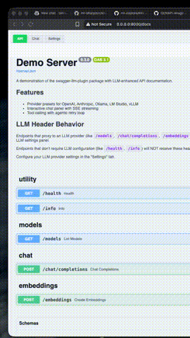
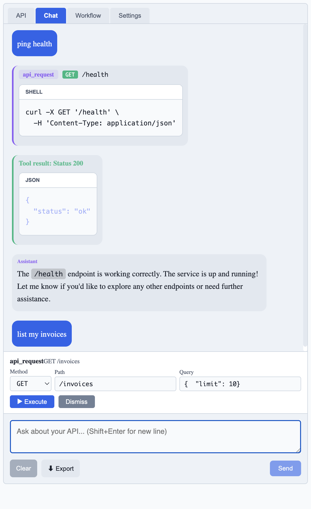
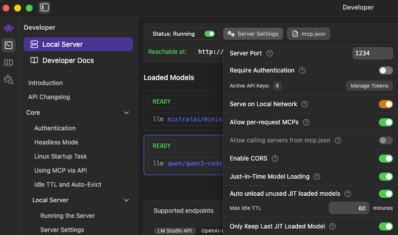

# Documentation Buddy

[](https://github.com/pearsonkyle/swagger-llm-ui/actions/workflows/ci.yml)


> Add an AI assistant to your `/docs` page.



## Features

- 💬 AI chat assistant with full OpenAPI context
- 🤖 LLM Settings panel with local providers (Ollama, LM Studio, vLLM, Custom)
- 🔗 Tool-calling for API Requests
- 🎨 Dark/light theme support

## Installation

```bash
pip install docbuddy
```

## Quick Start

```python
from fastapi import FastAPI
from docbuddy import setup_docs

app = FastAPI()
setup_docs(app)  # replaces default /docs
```

That's it! Visit `/docs`

## Using the Chat Assistant

Ask questions like:
  - "What endpoints are available?"
  - "Create a curl cmd for adding a new user"
  - "Ping health"

Enable tool calling in the settings to allow the assistant to make API requests on your behalf.



## Configure LLM Settings

- **Provider**: Choose your local LLM provider (Ollama, LM Studio, vLLM, or Custom)
- **API URL**: Enter the API endpoint for your LLM (e.g. `http://localhost:1234/v1` for LMStudio)
- **Test Connection**: Verify that the plugin can connect to your LLM provider and select a model from the drop down after.

Some local LLM providers will require users to enable CORS in their API settings to allow the plugin to connect from the browser.



## Demo Server

```bash
uvicorn examples.demo_server:app --reload --host 0.0.0.0 --port 3333
```

## Development

```bash
pip install -e ".[dev]"

pytest tests/
pre-commit run --all-files

hatch run test
hatch run format
```
