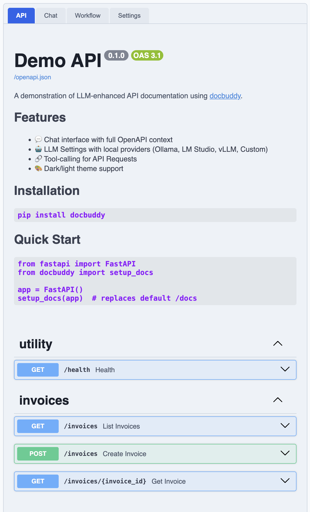
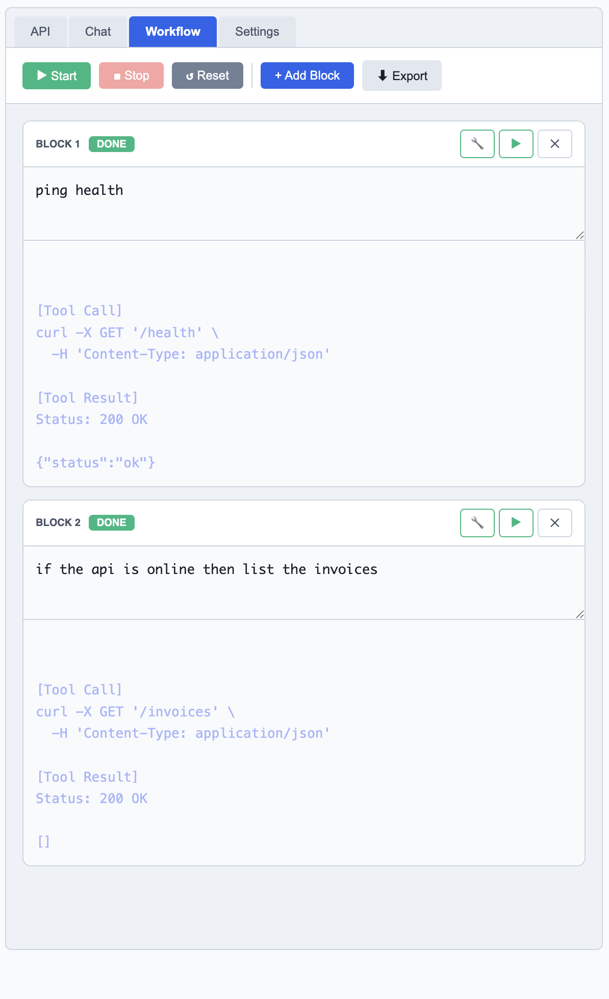
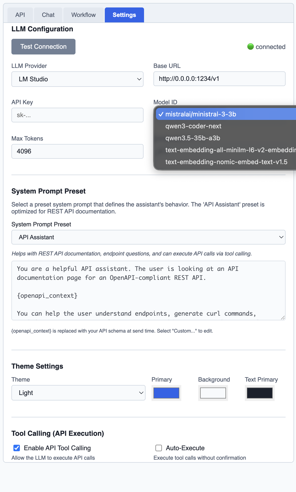

# Documentation Buddy

[](https://github.com/pearsonkyle/swagger-llm-ui/actions/workflows/ci.yml)
[](https://badge.fury.io/py/docbuddy)
[](https://pypi.org/project/docbuddy/)
[](https://opensource.org/licenses/MIT)
[](https://pepy.tech/project/docbuddy)
[](https://fastapi.tiangolo.com/)

> Add an AI assistant to your `/docs` page.

### Try the [Live Demo](https://pearsonkyle.github.io/DocBuddy/)

## Installation

```bash
pip install docbuddy
```

## Quick Start

```python
from fastapi import FastAPI
from docbuddy import setup_docs

app = FastAPI()
setup_docs(app)  # replaces default /docs
```

That's it! Visit `/docs`

| API Explorer | Chat Interface |
|--------------|----------------|
|  |  |

| Workflow Panel | LLM Settings |
|---------------|--------------|
|  |  |


## Features

- 💬 Chat interface with full OpenAPI context
- 🤖 LLM Settings panel with local providers (Ollama, LM Studio, vLLM, Custom)
- 🔗 Tool-calling for API Requests
- 🎨 Dark/light theme support


## Using the Chat

Ask questions like:
  - "What endpoints are available?"
  - "Create a curl cmd for adding a new user"
  - "Ping health"

Enable tool calling in the settings to allow the assistant to make API requests on your behalf.

## LLM Settings

- **Provider**: Choose your local LLM provider (Ollama, LM Studio, vLLM, or Custom)
- **API URL**: Enter the API endpoint for your LLM (e.g. `http://localhost:1234/v1` for LMStudio)
- **Test Connection**: Verify that the plugin can connect to your LLM provider and select a model from the drop down after.

Some local LLM providers will require users to enable CORS in their API settings to allow the plugin to connect from the browser.


## GitHub Pages (Standalone Mode)

DocBuddy can be used as a standalone page hosted on GitHub Pages at https://pearsonkyle.github.io/DocBuddy/

### Loading Your OpenAPI Schema

1. Enter the URL of your `openapi.json` file (or a `/docs` page)
2. Click "Load" to explore with AI chat, workflow, and agent panels

### LLM Connection Notes

When using the standalone GitHub Pages version:

- **To connect to localhost LLMs** (Ollama, LM Studio, vLLM): You must run DocBuddy locally instead of from GitHub Pages. Browser security (CORS) prevents web pages hosted on `github.io` from making requests to `localhost`.

  **Solutions:**
  - Run `python3 -m http.server 8080` from the repo root and visit `http://localhost:8080/docs/index.html`
  - Deploy using the Python package (`pip install docbuddy`) instead of GitHub Pages

- **To connect to remote LLMs**: No special configuration needed. Just enter the public URL.

## Demo Server

```bash
uvicorn examples.demo_server:app --reload --host 0.0.0.0 --port 3333
```

## Development

```bash
pip install -e ".[dev]"

pytest tests/
pre-commit run --all-files
```
